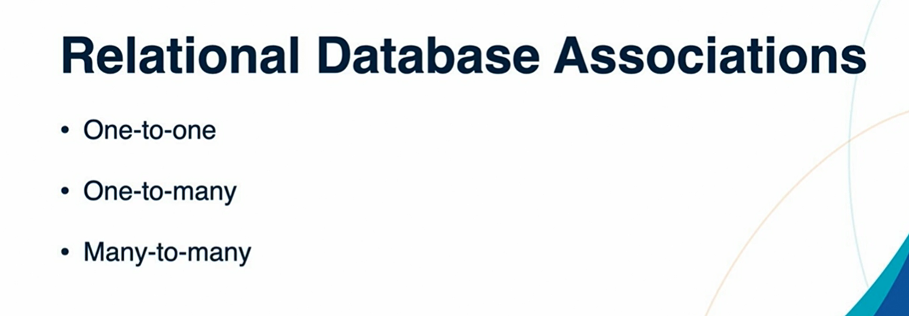

### One to many associations between models



At least we need two model to create a associaltion.

we have already Task model. now lets create another model ta
````
rails g model Category name:string

````

create another migration to create fogrin key attribute.

````
rails g migration AddCategoryIdTasks

Edit the migration 

class AddCategoryIdTasks < ActiveRecord::Migration[7.0]
  def change
    
    add_column(:tasks, :category, :integer, index: true )
  end
end
````