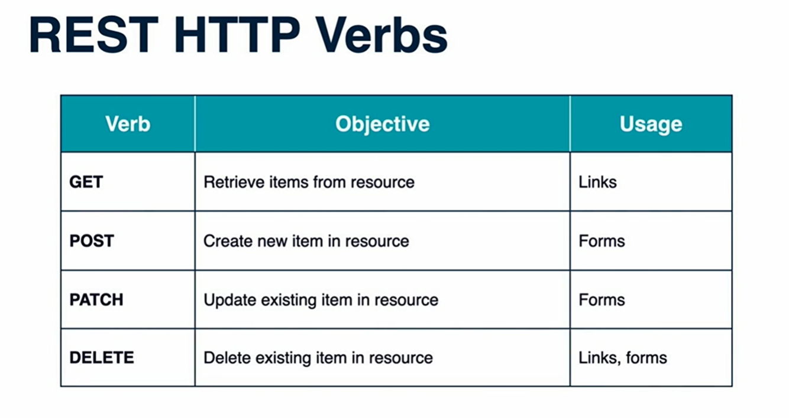
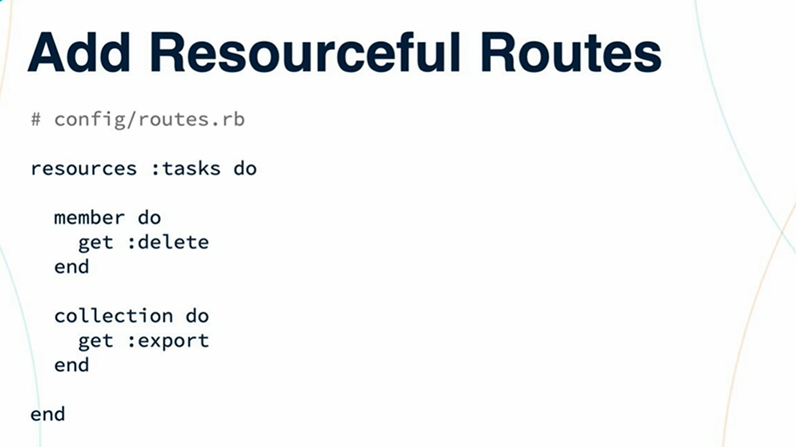
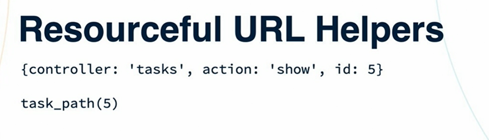
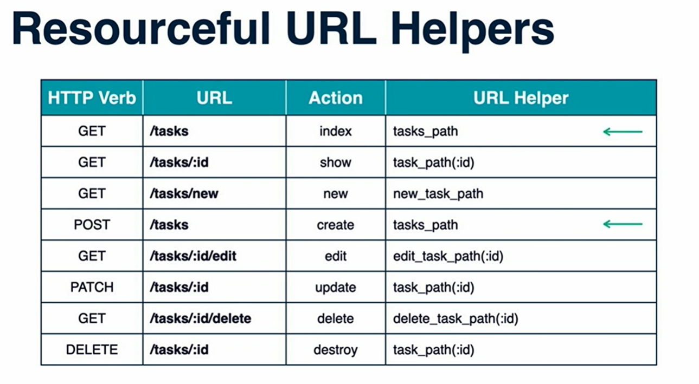

### REST HTTP Verbs


You can also omit the routes if you dont need that


if you need more verbs 



````
rails g model Category name:string

````

### Resouceful URL Helpers



Complete Resourcful url helpers 

