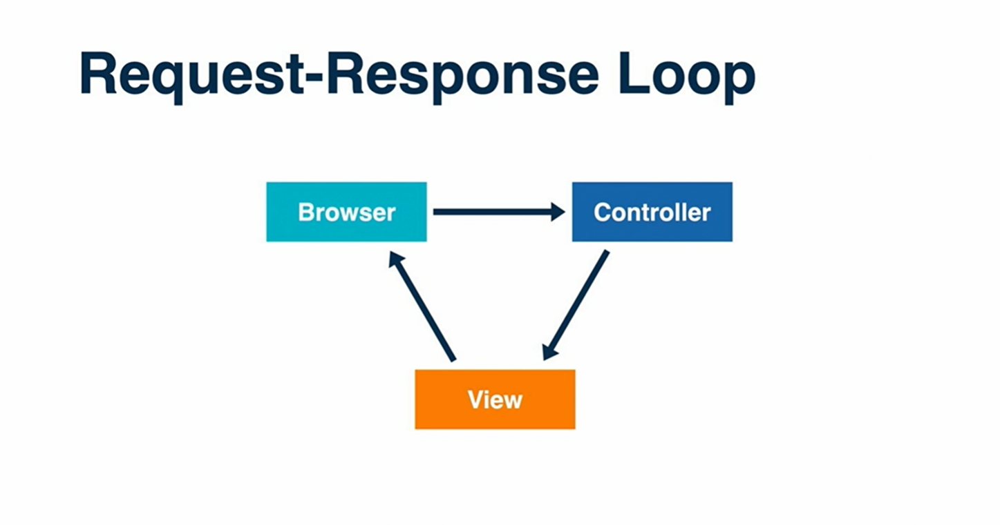

### Request Response Loop



Rendering different template from different action.

````
  def index
    render('main/about') //rendering about page from index action
  end

  def about
    render("main/index") // rendering index page from about action
  end
````