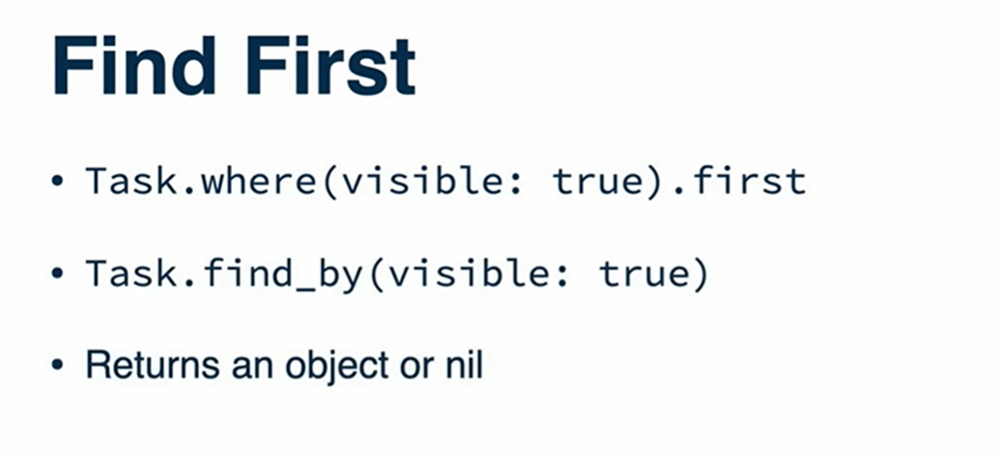

### Create Records using ActiveRecord

There are two methood to create a new record

#### methood 1


````
task = Task.new(name: "first task", position:1)

task // it will return a task object

task.save

task.new_record?


````

#### Methood 2


````
Task.create(name: "first task", position:1)

````

### Update Records using ActiveRecord

There are also two methood to update a record.

#### Methood 01


````
task = Task.find(1)

task.name = "updated name "

task.save

````
#### Methood 02


````
task2 = Task.find(1)

task2.update(name: "updated name ")

````

### Delete Records using ActiveRecord


````
task = Task.find(1)

task.destroy

````

### Find Records using ActiveRecord





````
tasks.count

The safe methood is like below

tasks = Task.where(['name LIKE ?', '%shop%'])

````